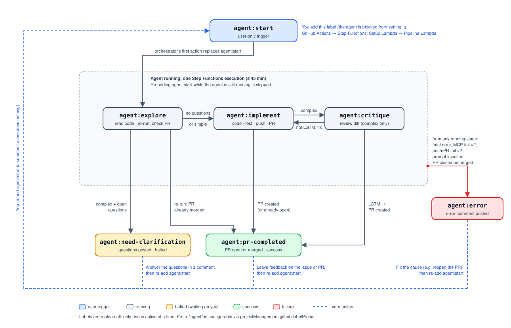

# Project Management

> [!IMPORTANT]
> This sample is in preview and under active development.

Each project management integration has two parts:

1. **MCP Server** — provides issue tools (read, write, comment, label) so the coding assistant can interact with tickets during execution
2. **Connector** — triggers the pipeline when work is assigned (e.g., a label is added to an issue)

## Existing Implementations

| Platform | Directory | Status |
|----------|-----------|--------|
| GitHub Issues | [`github/`](./github/) | Production |
| Jira | — | Planned |

## Architecture

```
Developer adds label ──► Connector (GitHub Actions / webhook)
                              │
                              ▼
                         Step Functions
                         (Setup → Pipeline)
                              │
                              ▼
                         Coding Assistant
                              │
                              ▼
                     Project Management MCP
                     (read issue, post comments, set labels)
```

## Label State Machine

The coding assistant reports progress by replacing the issue's single `agent:*` label. Only a human may set `agent:start`. Add it to start a run, and re-add it after commenting to resume from `agent:need-clarification`, `agent:pr-completed`, or `agent:error`. The `agent` prefix is configurable via `projectManagement.github.labelPrefix`.



| Label | Set by | Meaning |
|-------|--------|---------|
| `agent:start` | User only | Triggers the pipeline (blocked for the agent by `label-governance.sh`) |
| `agent:explore` | Agent | Run started; exploring the codebase / checking an existing PR |
| `agent:need-clarification` | Agent | Questions posted on the issue; halted until the user answers and re-adds `agent:start` |
| `agent:implement` | Agent | Writing code, running tests, pushing, opening the PR |
| `agent:critique` | Agent | Reviewing the diff (complex issues only) |
| `agent:pr-completed` | Agent | Terminal success: PR created or already merged |
| `agent:error` | Agent | Terminal failure: error comment posted |

## Useful MCP Tools

Tools that a project management MCP server typically exposes:

| Tool | Description |
|------|-------------|
| `issue_read` | Get issue details (title, body, comments) |
| `issue_write` | Update issue title, body, or labels (labels are replace-all) |
| `add_issue_comment` | Post a progress comment on the issue |
| `set_labels` | Set status labels (`agent:explore`, `agent:pr-completed`; see [Label State Machine](#label-state-machine)) |
| `list_issues` | List/filter issues in a project |

## Adding a New Project Management Platform

### Step 1: Create the directory structure

```
project-management/<platform>/
├── mcp/
│   ├── main.py              # MCP server (issue tools)
│   ├── Dockerfile
│   └── pyproject.toml
└── connector/
    ├── lambda/
    │   └── index.py         # Setup Lambda (create session, clone repo)
    ├── workflow/             # Trigger mechanism (Actions, webhook, etc.)
    └── README.md
```

### Step 2: Implement the MCP server

Same pattern as source control — an MCP server on port 8000 with platform-specific auth. See [`github/mcp/main.py`](./github/mcp/main.py) for the full implementation.

### Step 3: Implement the connector

The connector is what starts the pipeline. For GitHub, it's a GitHub Actions workflow. For Jira, it might be a webhook receiver Lambda.

**GitHub Actions trigger** ([`github/connector/workflow/agent-start.yml`](./github/connector/workflow/agent-start.yml)):

```yaml
name: agent-assisted-sdlc
on:
  issues:
    types: [labeled]

jobs:
  trigger-pipeline:
    if: github.event.label.name == 'agent:start'
    runs-on: ubuntu-latest
    steps:
      - name: Resolve issue details via GraphQL
        run: |
          gh api graphql -f query='...' > issue.json

      - name: Start pipeline
        run: |
          aws stepfunctions start-execution \
            --state-machine-arn $STATE_MACHINE_ARN \
            --input "$(cat payload.json)"
```

The connector must:
1. Detect the trigger event (label, webhook, etc.)
2. Resolve the full issue context (title, body, comments, author, repo)
3. Authenticate to AWS (OIDC, IAM role, API key)
4. Start the Step Functions state machine with the issue payload

### Step 4: Implement the setup Lambda

The setup Lambda runs first in the state machine. It creates a runtime session, copies plugins, and clones the repo. See [`github/connector/lambda/index.py`](./github/connector/lambda/index.py).

Key responsibilities:
```python
def handler(event, context):
    # 1. Create AgentCore runtime session
    session_id = str(uuid.uuid4())

    # 2. Copy plugin to workspace
    execute_command(runtime_arn, session_id,
        f"cp -r /mnt/plugins/{plugin_name}/* /mnt/workplace/")

    # 3. Clone the target repo
    execute_command(runtime_arn, session_id,
        f"git clone {repo_url} /mnt/workplace/gitproject")

    # 4. Return session info for the pipeline Lambda
    return {"session_id": session_id, "issue": event["issue"], ...}
```

### Step 5: Add invocation logic

The pipeline Lambda ([`shared/invoke_pipeline.py`](./shared/invoke_pipeline.py)) calls `execute_command()` ([`shared/pipeline.py`](./shared/pipeline.py)) to run the coding assistant CLI inside the AgentCore runtime.

`execute_command()` sends SigV4-signed HTTP requests to the AgentCore Runtime API and streams the response.

### Step 6: Add CDK stack

Create `lib/nested/project-management-stack.ts`. See the [existing implementation](../lib/nested/project-management-stack.ts) which deploys:
- MCP server runtime via `McpServer` construct
- Gateway target registration via `registerGatewayTarget()`

### Step 7: Configure

```yaml
projectManagement:
  type: jira
  jira:
    siteUrl: "https://your-org.atlassian.net"
    projectKey: "PROJ"
    clientId: ""
    clientSecret: ""
```

## Shared Utilities

The [`shared/`](./shared/) directory contains code used by all project management platforms:

| File | Purpose |
|------|---------|
| `pipeline.py` | `execute_command()` — sends commands to AgentCore Runtime via SigV4 HTTP |
| `invoke_pipeline.py` | Lambda handler that runs the coding assistant CLI |
| `assistants/` | Strategy classes for each coding assistant type |
